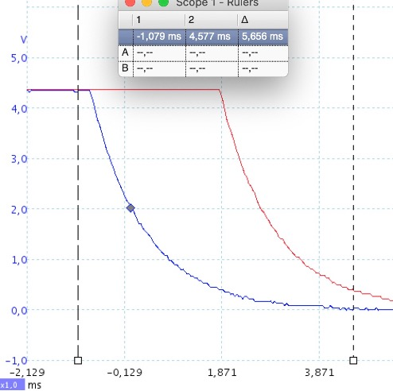
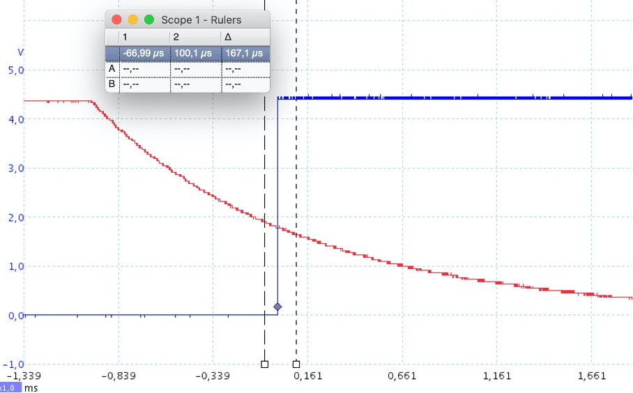
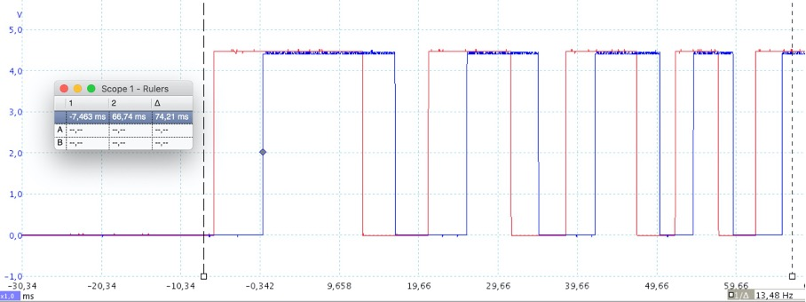

## Tips for debouncing your Encoder
Most encoders are very simple devices, that only consist of two mechanical switches, that are mechanically matched to toggle at different angular positions.   
Like all mechanical switches, they are not digitally flipping between on and off, but tend to 'bounce' between both states. That is not a problem if you switch a slow bulb, but a fast microprocessor input will notice.

    
**Img 3:** _Oscilloscope trace of one channel of an ALPS rotary encoder. You can see the bouncing during the transition from off to on. The bounce here takes about 400µs. The ALPS specification allows even up to 2ms._    

To filter the high frequency signals (the spikes) out, you can use a simple extension of your circuit with two resistors (R1 and R2) and a capacitor (C1) per channel.
I use four resistors of R=10kΩ and two capacitors of C=100nF. The timeconstant for charging is     
     
and for discharging     
    
respectively (after the timeconstant has passed the charge will be on _1/e_ of its reference level).      

    
**Img 4:** _Schematic of rotary with RC-filters for debouncing. C1 gets charged via R1+R2 when the switch is open and discharged via R2 when it is closed. The same setup is copied for the second channel._

This will remove the spikes but also slow down the transition between the states of the switch. As long as it is fast enough, that usually is no issue. To estimate what 'fast enough' means, consider the number of detents of your rotary and how fast you need to turn it (mine has 30 detents per revolution and a normal user does less than half a turn per second, so worst case there is a switch every 1000/20 = 50 Milliseconds).  

    
**Img 5:** _Both channels with RC-filter. The transition takes 6ms now(~10 times longer, still 10 times faster than needed), but the spikes are gone. I calculated the RC values based on the ALPS spec of up to 2ms bounce. You can see, that the voltage (i.e. charge on the capacitor) has reduced from 4.3V to 4.3V/2.7 = 1.6V after about 1ms, as expected with 10kΩ and 0.1µF._   

    
**Img 6:** _Both channels during a longer extra fast rotational move of about 120°. You can feel 10 'clicks' during the move shown (1/2 period per step). The speed of rotation determines the length of the peaks. When the speed increases much more, the peaks will not reach the high and low levels anymore, eventually causing problems when the GPIO can no longer distinguish a high from a low. This has to be taken into account when selecting your R and C. The turn shown is much faster, than what I expect to see from my normal user._   

If you want more crisp transitions with full amplitude again, you can add an additional Schmitt-Trigger like the _74HC 14_ (6-channels for less than 0.50€) on top of the RC-filter. That will change your rotary encoder signal to something very sharp and defined. However, make sure that input level still passes the upper and lower threshold of the Schmitt, if you turn the button fast.

    
**Img 7:** _The output of the RC-Filter connected to an additional Schmitt-Trigger. You should add a 100nF buffer-capacitor between VCC and GND and floating inputs should be pulled to a reference potential. (both not shown here)_

       
**Img 8:** _Input (red) and Output (blue) of the Schmitt-Trigger. You can see, that the signal makes a very sharp transition from low to high when the input falls below the threshold. Note, that the output is inverted, but for the rotary operation that does not matter._

      
**Img 9:** _Both channels with Schmitt-Trigger. A signal like from a text-book for digital logic. Note how you can even see the acceleration during the turn. The squares become shorter from left to right._   

